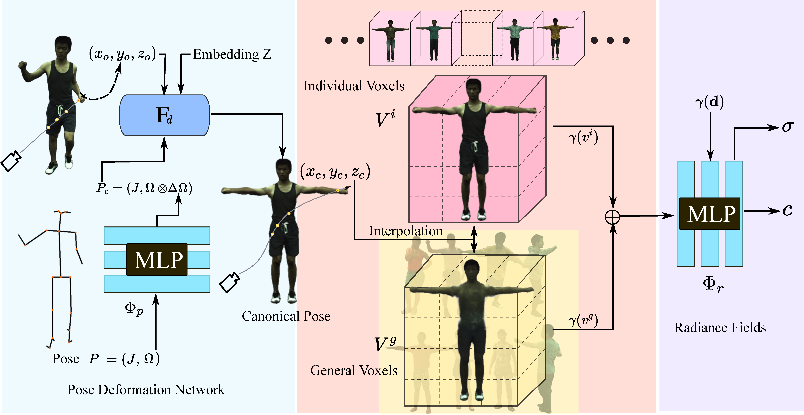

# GNeuVox: Generalizable Neural Voxels for Fast Human Radiance Fields
### [Project Page](https://taoranyi.github.io/geneuvox) | [Arxiv Paper](https://arxiv.org/abs/) | [Video](https://youtu.be/fzaKbZhKIFI)

[Generalizable Neural Voxels for Fast Human Radiance Fields](https://taoranyi.github.io/geneuvox)

[Taoran Yi](https://github.com/taoranyi)1*, 
[Jiemin Fang](https://jaminfong.cn/)2,1*, [Xinggang Wang](https://xinggangw.info/)1✉,  [Wenyu Liu](http://eic.hust.edu.cn/professor/liuwenyu/)1  
1School of EIC, HUST &emsp; 2Institute of AI, HUST &emsp;  
*denotes equal contributions.

In this paper, we propose a rendering framework that can learn moving human body structures extremely quickly from a monocular video, named as GNeuVox. The framework is built by integrating both neural fields and neural voxels. Especially, a set of generalizable neural voxels are constructed. With pretrained on various human bodies, these general voxels represent a basic skeleton and can provide strong geometric priors. For the fine-tuning process, individual voxels are constructed for learning differential textures, complementary to general voxels. Thus learning a novel body can be further accelerated, taking only a few minutes. Our method shows significantly higher training efficiency compared with previous methods, while maintaining similar rendering quality.
## Prerequisite

### Configure Environment

Create and activate a virtual environment.

    conda create --name gneuvox python=3.7
    conda activate gneuvox

Install the required packages.

    pip install -r requirements.txt

### Download SMPL Model

Download the gender neutral SMPL model from [here](https://smplify.is.tue.mpg.de/), and unpack **mpips_smplify_public_v2.zip**.

Copy the smpl model.

    SMPL_DIR=/path/to/smpl
    MODEL_DIR=$SMPL_DIR/smplify_public/code/models
    cp $MODEL_DIR/basicModel_neutral_lbs_10_207_0_v1.0.0.pkl third_parties/smpl/models

Follow [this page](https://github.com/vchoutas/smplx/tree/master/tools) to remove Chumpy objects from the SMPL model.

## Data Preparation

### Prepare The ZJU-Mocap Dataset
First, download ZJU-Mocap dataset from [here](https://github.com/zju3dv/neuralbody/blob/master/INSTALL.md#zju-mocap-dataset). 

Second, modify the yaml file of subject 377 at `tools/prepare_zju_mocap/377.yaml` (e.g., subject 377).

Finally, run the data preprocessing script.

    cd tools/prepare_zju_mocap
    python prepare_dataset.py --cfg 377.yaml
    python prepare_dataset_eval.py --cfg 377_eval.yaml
    cd ../../

### Prepare The People Snapshot Dataset

First, you have to first read and agree the license terms [here](https://graphics.tu-bs.de/people-snapshot). Then you can download the data we have processed with EasyMocap from [google drive](https://drive.google.com/drive/folders/1wJ1oj82eGNXp0xjGmzNj_-SguE60ikB7?usp=sharing) and [baidu drive](https://pan.baidu.com/s/1yaxXwdWJ4dB2zV1iQ6rU-g?pwd=ko2e).

### Prepare A Monocular Self-rotating Video
Use [EasyMocap](https://chingswy.github.io/easymocap-public-doc/quickstart/quickstart.html#demo-on-monocular-videos) to process the video and run the data preprocessing script.

    cd tools/prepare_easy_mocap
    python prepare_datase_easy_mocap.py --cfg easy_mocap.yaml
    cd ../../

## Training

    python train.py --cfg configs/scene/zju_mocap/377.yaml
You can download the pretrained models from [google drive](https://drive.google.com/drive/folders/1wJ1oj82eGNXp0xjGmzNj_-SguE60ikB7?usp=sharing) and [baidu drive](https://pan.baidu.com/s/1yaxXwdWJ4dB2zV1iQ6rU-g?pwd=ko2e). Put the pretrained models in `experiments/$task/$experiment`. Then use `_C.resume = True` in `configs/config.py` to load the pretrained models.

## Evaluation
You can use the following script to evaluate the model.

    python eval.py --cfg configs/scene/zju_mocap_eval/377.yaml 

## Render output
Render the frame input (i.e., training sequence).

    python run.py --type movement \
       --cfg configs/scene/zju_mocap_eval/377.yaml   

Run free-viewpoint rendering on a particular frame (e.g., frame 128).

    python run.py --type freeview \
        --cfg configs/scene/zju_mocap_eval/377.yaml   \
        freeview.frame_idx 128

Render the learned canonical appearance (T-pose).

    python run.py --type tpose \
        --cfg configs/scene/zju_mocap_eval/377.yaml   
## Main results
### The ZJU-Mocap Dataset
| **Method** | **Pretrain Dataset**  | **Perscene Iterations** |**Time** | **PSNR** | **SSIM** | **LPIPS** (x10-2)|
|:-:|:-:|:-:|:-:|:-:|:-:|:-:|
Neural Body | ✗ |- | - |29.08| 0.9616 |5.229
HumanNeRF | ✗ | 400k |∼ hours |30.24 |0.9680 |3.173
GNeuVox  |✗ |10k|50 mins| 30.26 |0.9678| 3.450
GNeuVox   |ZJU-MoCap |1k |5 mins|30.26 |0.9682| 3.420
GNeuVox | Human3.6M |3k |15 mins |30.11 |0.9677 |3.399

